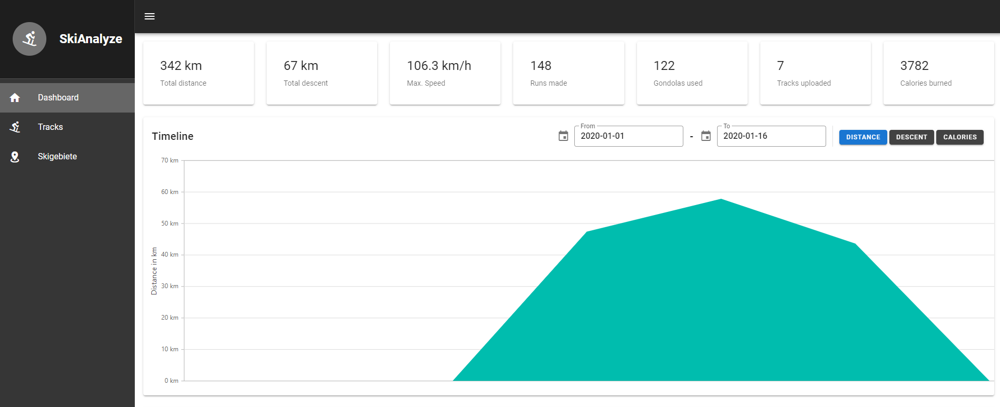
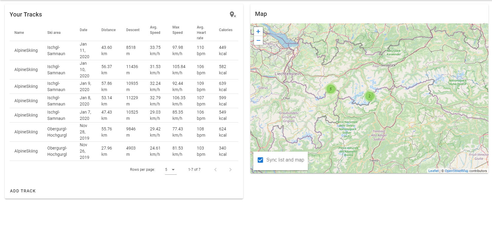
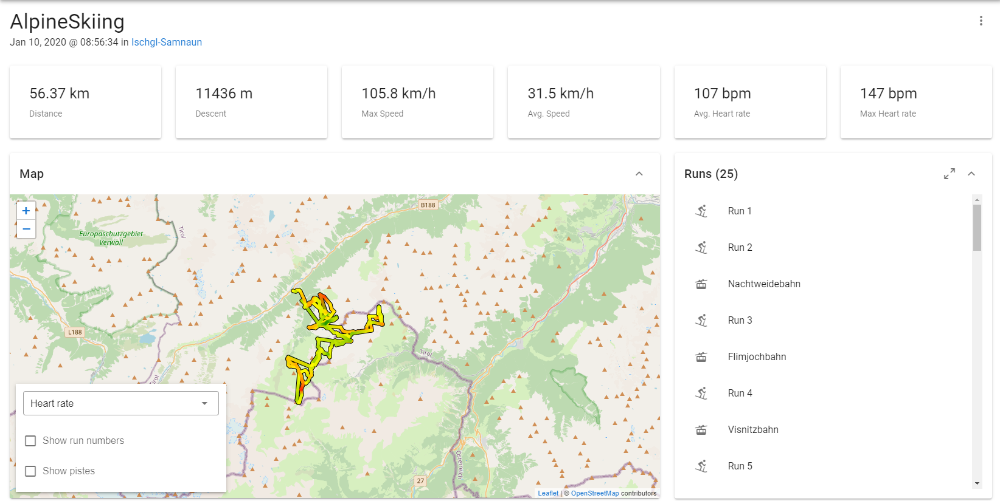
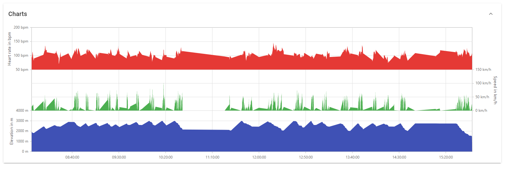
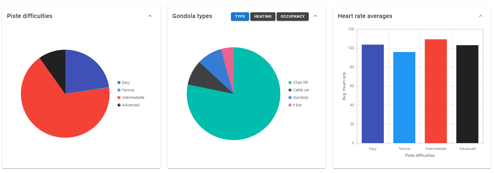
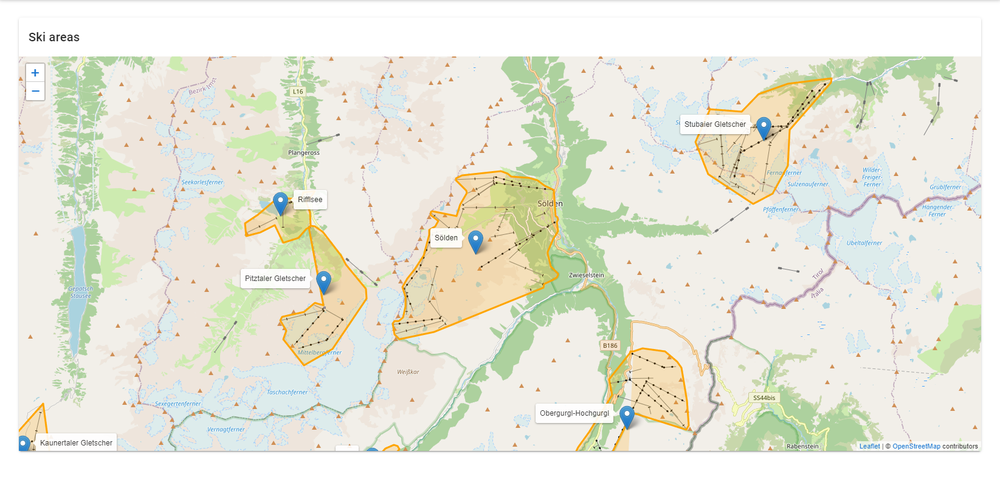
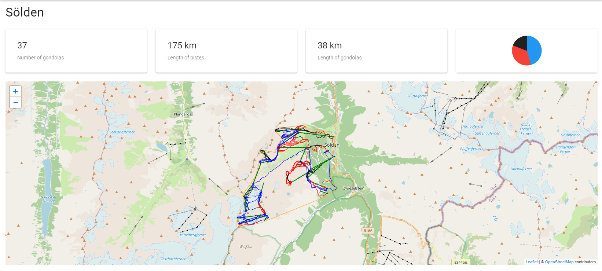
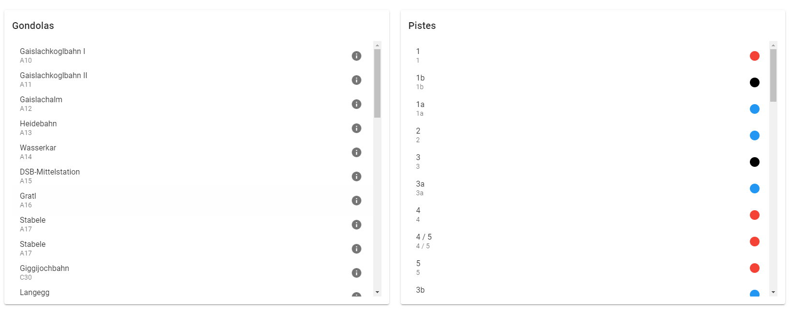

# SkiAnalyze

SkiAnalyze is a fun application that let's you analyze your GPX-Tracks or [Garmin Fit-Files](https://developer.garmin.com/fit/download/) of your last skiing trips.

It uses the data of your track and tries to match the data with information from [OpenStreetMap](https://www.openstreetmap.org/) ([OpenSnowMap](http://www.opensnowmap.org/iframes/data.html)) to give some useful or not so useful statistics (Like, do you prefer heated gondolas over the cold ones 😉).

Besides it allows to have a detailed look on some ski areas.

## Tech / Tools

### Backend
- .NET 6 and ASP.NET Core Backend
- EF Core 6 with SQLite for persistence
- [OSMSharp](http://www.osmsharp.com/) for getting the data from OpenStreetMap
- [Garmin FIT Sdk](https://developer.garmin.com/fit/download/) for reading the fit files

### Frontend
- Vue for the client side
- [Leaflet](https://leafletjs.com/) ([vue2-leaflet](https://vue2-leaflet.netlify.app/)) for displaying maps
- [Leaflet.hotline](https://github.com/iosphere/Leaflet.hotline) for the nice colored polylines 
- [Leaflet.markerCluster](https://github.com/Leaflet/Leaflet.markercluster) for the track overview map
- [Syncfusion Vue Components](https://www.syncfusion.com/vue-ui-components/vue-charts) for the charts
- [vuei-i18n](https://kazupon.github.io/vue-i18n/) for translations 
- [axios](https://github.com/axios/axios) for api calls

## Run it yourself

1. Clone the project
2. Download the OpenSnowMap dataset (about 900mb) from [here](http://www.opensnowmap.org/iframes/data.html)
3. Make sure to change the path in the appsettings.json file to point to the downloaded osm file, or copy the osm file in the same directory as the appsettings.json (src/SkiAnalyze)
4. Run `dotnet run` inside the SkiAnalyze directory
5. On the first start the osm file is crawled for all the needed data (pistes, gondolas, skiareas). After this, the data is stored in the SQLite database for faster queries.
In the appsettings.json is configured, to which bound the search is limited to. By default it is roughly all the alps.
6. After the server startup go to `https://localhost:5001` in your browser.

## Get your .gpx or .fit files
If you're using Garmin watches like me, you can either connect your watch directly to your PC and find your activities .fit file there.

Alternativly you can open up [Garmin Connect](https://connect.garmin.com/), find your activity there and export the original file. I recommend using the original .fit file over exporting .gpx, because the .fit file has way more, and more accurate data.

# Screenshots

### Dashboard

### Track overview

### Track detail

### Ski areas

### Ski area detail

# Notes

All data, that is shown in the app is provided by [OpenStreetMap](https://www.openstreetmap.org/) and it's contributors. The app is meant to be a fun tool and does by no means claim to be correct or valid.